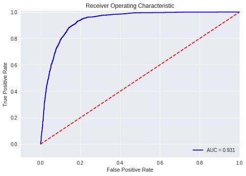

# Bank-Marketing-Analysis

## Objective

1. Bank Marketing dataset is collected from direct marketing campaign of a bank institution from Portuguese.

2. Marketing campaign can be understood as phone calls to the clients to  convince them accept to make a term deposit with their bank.

3. After each call, they are being noted as to no - being the client did  not make a deposit and yes - being the client on call accepted to make a  deposit.

4. The purpose of this project is to predict if the client on call would  accept to make a term deposit or not based on the information of the  clients.
5. For More Information refer https://archive.ics.uci.edu/ml/datasets/Bank+Marketing

## Main  Issues with the dataset

1. There is data imbalance between two classes The number of yes(1) is very low in comparison to no(0)

2. Missing Value in the dataset.

## Techniques Used

1. Visualizing the data and filling missing value of each column with DecisionTreeClassifier
2. To deal with data imbalance we use SMOTE - Synthetic Minority
   Over-sampling Technique. 
   * SMOTE creates synthetic (not duplicate) samples of the minority class. Hence 
     making the minority class equal to the majority class. SMOTE does this 
     by selecting similar records and altering that record one column at a 
     time by a random amount within the difference to the neighbouring 
     records.
3. Use Logistic regression for training

## Result

### AUC = 0.931

class|precision|recall|f1-score
-----------|-----------|--------|--------
0|0.98|0.85|0.91
1|0.44|0.89|0.59